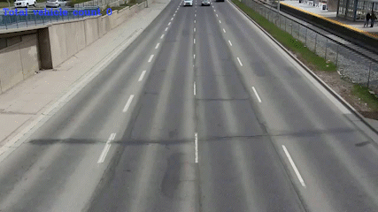

# Object Tracking using TF object detection, Deep Sort and Tensorflow
This repository implements SSD model and Deep SORT in order to perfrom real-time object tracking. Tensorflow object detection(SSD mobilenet) is an algorithm that uses deep convolutional neural networks to perform object detection. We can feed these object detections into Deep SORT (Simple Online and Realtime Tracking with a Deep Association Metric) in order for a real-time object tracker to be created.



## Getting started

#### Conda (Recommended)

```bash
# Tensorflow CPU
conda env create -f conda-cpu.yml
conda activate tracker-cpu

# Tensorflow GPU
conda env create -f conda-gpu.yml
conda activate tracker-gpu
```

#### Pip
```bash
# TensorFlow CPU
pip install -r requirements.txt

# TensorFlow GPU
pip install -r requirements-gpu.txt
```


## train tensorflow object detection model

I used 8 claases of vehicle = 'auto', 'bus','car','lcv','motorcycle','multiaxle','tractor','truck'

#download/clone TF object detection api and install 
--https://github.com/tensorflow/models.git

# download pre train model
pre-trained model = ssd_mobilenet_v1_fpn_640x640_coco17_tpu-8
download model from tensorflow model zoo

Training insturction in Train.ipynb

## Running the Object Tracker
### deep_sort is used to track object in videos,
It generates a track id for object and uses kalman filter which predicts future location of vehicle
  
First detect the objects by using ssd model and fed into the tracker as i did in 
Trck.ipynb file  and counted them

#Final result - 
            https://drive.google.com/file/d/1-2iiwQ8Vi2hOKUkoH-0t2Y24c73yQJ0i/view?usp=sharing
https://drive.google.com/file/d/1-CaKsKTo9i2ZXuWgeCJcL8lD0DeAvKBD/view?usp=sharing
#### Video Example


## Acknowledgments

* [Deep SORT Repository](https://github.com/nwojke/deep_sort)
